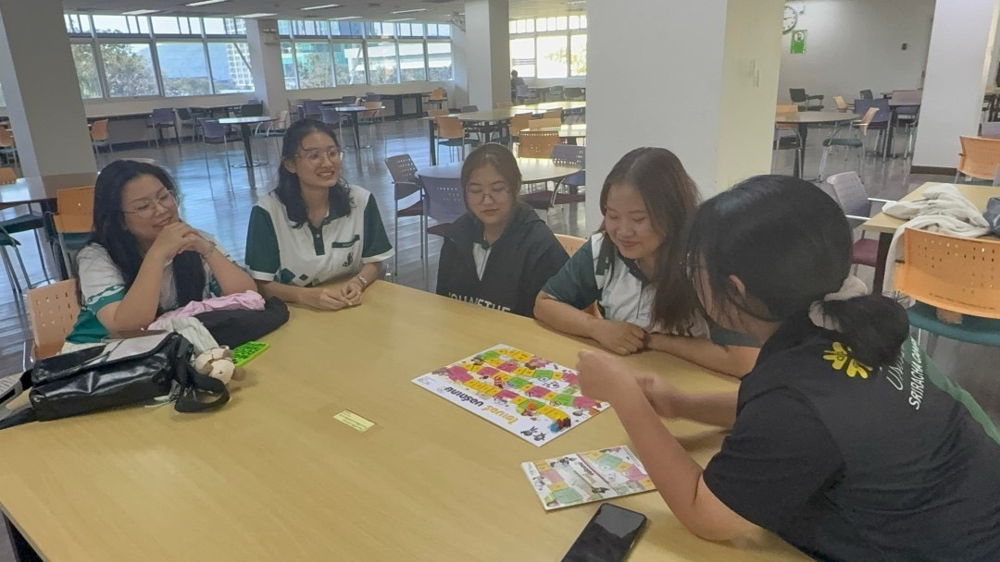
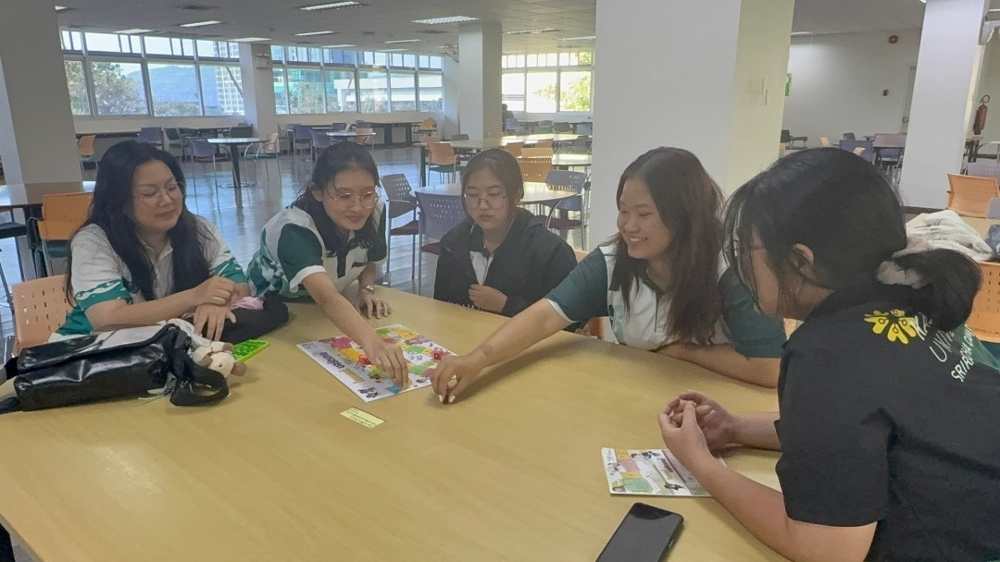
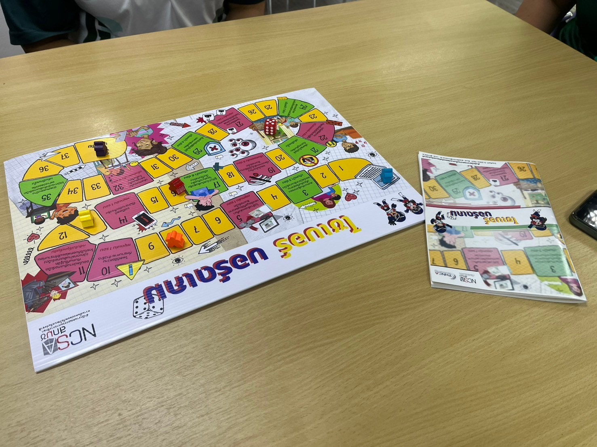

# Securing the Human

# Group: Ai ma 5 khon

เมื่อวันที่ 8 มกราคม 2568 เวลา 15:00 น. ณ หอสมุด มหาวิทยาลัยเกษตรศาสตร์ วิทยาเขตศรีราชา กลุ่มนิสิตจากสาขาวิชาวิทยาการคอมพิวเตอร์ภายใต้ชื่อ “Ai ma 5 khon” ได้จัดกิจกรรมเพื่อส่งเสริมความเข้าใจและพัฒนาทักษะด้านความมั่นคงปลอดภัยไซเบอร์ให้กับนิสิตคณะวิทยาการจัดการ สาขาการบัญชี โดยใช้บอร์ดเกมที่พัฒนาโดยสำนักงานคณะกรรมการการรักษาความมั่นคงปลอดภัยไซเบอร์แห่งชาติ (สกมช.) เป็นเครื่องมือหลัก

โดยในกิจกรรมครั้งนี้ทางกลุ่มผู้จัดได้ขออนุญาตผู้เข้าร่วมถ่ายภาพและวิดีโอเพื่อบันทึกกิจกรรมดังกล่าว ซึ่งผู้เข้าร่วมกิจกรรมมีจำนวนทั้งหมด 5 คน แบ่งเป็นนิสิตสาขาการบัญชี 2 คน และตัวแทนสมาชิกจากกลุ่มผู้จัดทำอีก 3 คน

ตลอดการเล่นบอร์ดเกม นอกจากจะได้รับความสนุกสนานแล้ว ยังมีการพูดคุยแลกเปลี่ยนความคิดเห็นในประเด็นที่เกี่ยวข้องกับความมั่นคงปลอดภัยไซเบอร์ เช่น หลักปฏิบัติตามมาตรฐาน  เป็นต้น โดยบรรยากาศของกิจกรรมเต็มไปด้วยความเป็นกันเอง แต่แฝงไปด้วยสาระความรู้ที่มีคุณค่า

กิจกรรมในครั้งนี้เป็นตัวอย่างที่ดีของการนำเกมมาใช้ในเชิงสร้างสรรค์ เพื่อสร้างความตระหนักรู้ด้านไซเบอร์ให้กับสังคม และเป็นเครื่องมือสำคัญที่ช่วยกระตุ้นความสนใจในประเด็นที่เกี่ยวข้องกับความปลอดภัยบนโลกออนไลน์ได้อย่างมีประสิทธิภาพ

# Team Members

1. [Kemikha Chan-Ngam](https://kemikha01.github.io/boardgame)
2. [Panisara Wijar](https://6530200274.github.io/boardgame)
3. [Penpicha Priwa](https://penpicha31.github.io/boardgame)
4. [Manatsawee Piyasophasakul](https://manatsawee-pi.github.io/boardgame)
5. [Pattralada Pobteepheung](https://skyandz.github.io/boardgame)
